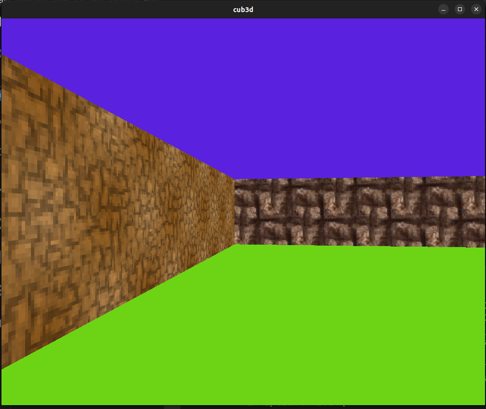
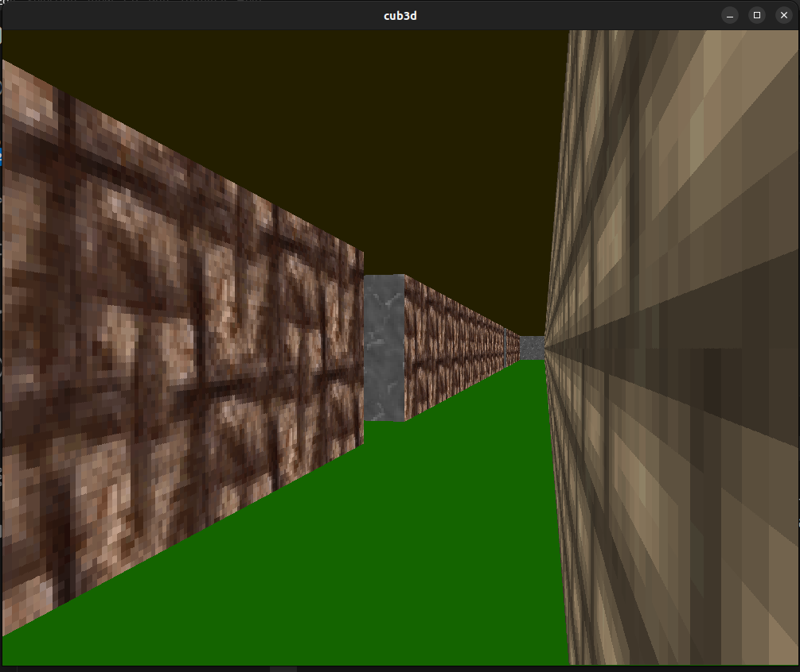
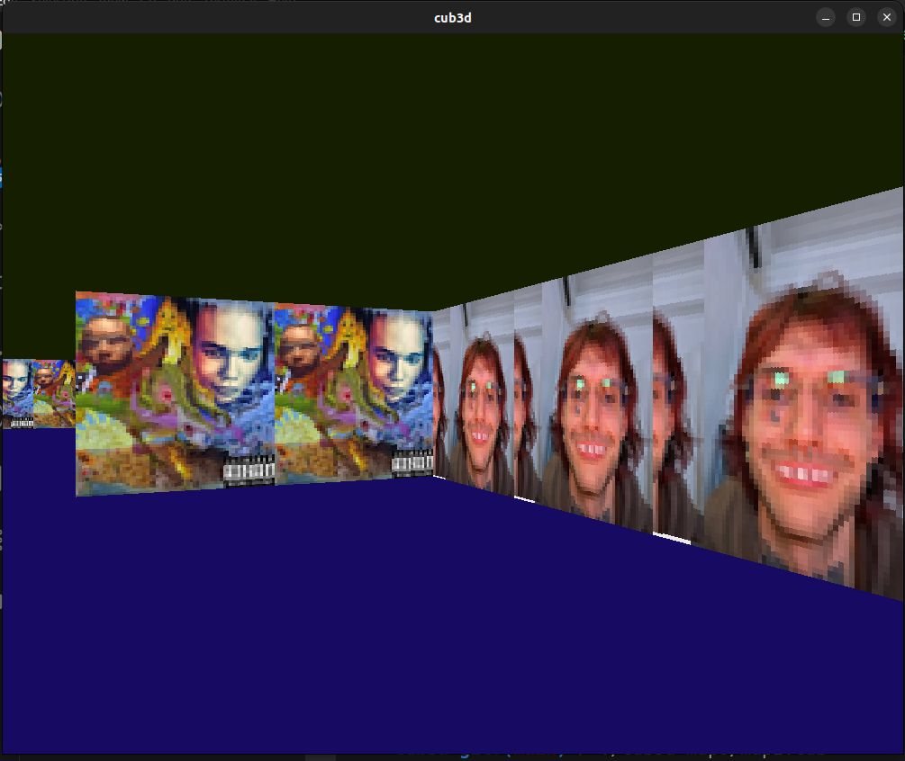

## Cub3D: Raycasting

### Intro 

As subject says *"This project is inspired by the world-famous Wolfenstein 3D game, which
was the first FPS ever. It will enable you to explore ray-casting. Your goal will be to
make a dynamic view inside a maze, in which you’ll have to find your way."*

**Cub3d** - is a team project in 42 Bangkok where you need to implement simple 3D-like walking simulator using **Raycasting** technique.
This project is done using MLX low-level graphical library in C language.


### Run it!
Follow these steps in order to try the project yoursel:

1. Clone the repo
   ```bash
     git clone git@github.com:bpassael/cub3d.git
   ```
2. Go to the cloned repo
   ```bash
     cd cub3d
   ```

3. Build project with Makefile
   ```bash
     make
   ```
4. Run the game with any map you prefer. Maps are located in ```maps/``` and you can make your own map.
   ```bash
     ./cub3d maps/map.cub
   ```
5. **Have fun!**

<p align="center">
  
  
  
</p>


